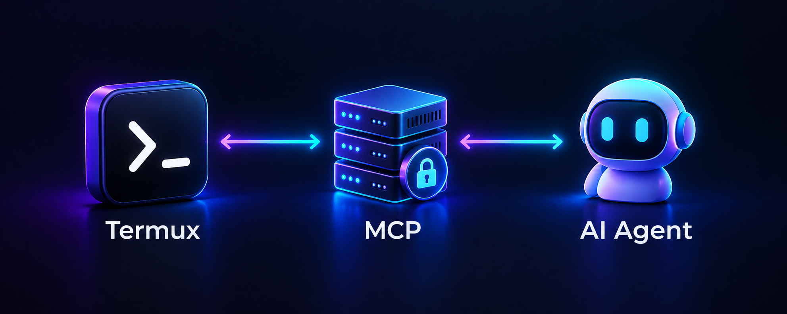
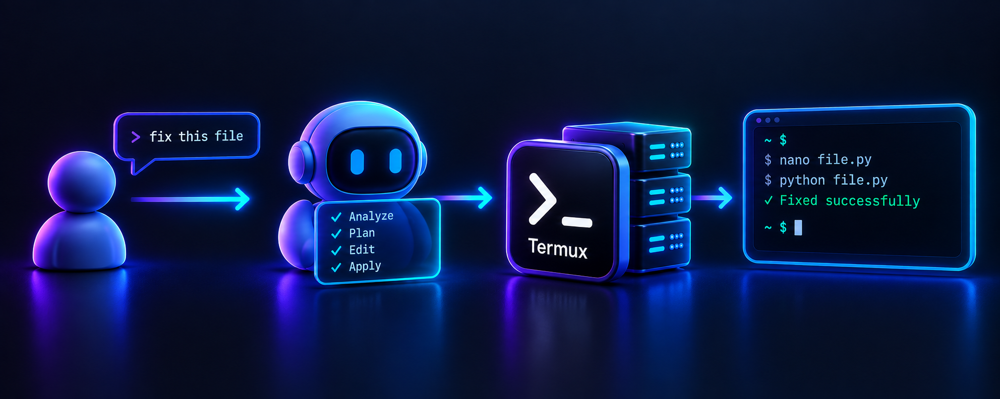

# Termux MCP



**Termux MCP** turns an Android phone running Termux into a remote execution environment for Claude Code, Codex-style tools, and other AI agents that support the Model Context Protocol (MCP).

The project runs a small MCP server inside Termux and exposes one deliberate capability: a full Bash shell for the current Termux user. The connected agent can inspect files, edit projects, install packages, run tests, use Git, and work with the tools already available on the phone.

> Termux MCP does not provide Android root access. It provides the permissions available to the current Termux user.

## How it works

An AI agent sends a task through MCP. Termux MCP delivers the agent's shell
work to the Android phone, where the command runs in the user's Termux
environment and the result is returned to the agent.



```text
AI agent → MCP URL → ngrok tunnel → Termux MCP server → Bash in Termux
```

The bridge is temporary. Running `tmcp` starts both the MCP server and the ngrok tunnel. Pressing `Ctrl+C` stops both processes.

## Requirements

You need an Android device with [Termux](https://termux.dev/) installed. Install Termux from [F-Droid](https://f-droid.org/packages/com.termux/) or the official Termux project sources rather than mixing packages from unrelated builds.

You also need an [ngrok account](https://dashboard.ngrok.com/signup) and its Authtoken. Each user supplies their own token locally; no token is included in this repository or sent to a project server.

## Install

Run these commands in Termux:

```bash
git clone https://github.com/craftultra000-png/Termux-mcp.git
cd Termux-mcp
chmod +x install.sh tmcp.sh
./install.sh
```

The installer checks that it is running in Termux, installs Python and the packages needed for the Android DNS workaround, installs the MCP dependency, detects the device architecture, downloads the matching ngrok binary, and asks for the user's Authtoken. The token is passed directly to ngrok's local configuration and is not written into project files.

## Run

After installation, start the bridge from any Termux directory with:

```bash
tmcp
```

The `tmcp` command uses the project directory recorded during installation, so it can be run from `~` or any other working directory.

The script prints an MCP URL similar to:

```text
https://example.ngrok-free.app/mcp
```

Copy that URL into your MCP-compatible AI agent. The URL is generated by the user's ngrok session and may change when the tunnel is restarted unless the user configures an ngrok domain in their own account.

Stop the bridge when finished:

```text
Ctrl+C
```

## Security warning

This project intentionally gives the connected AI agent full shell access to the current Termux user. That includes the ability to create, modify, execute, and delete files and to run commands available in the Termux environment.

Treat the MCP URL as a private remote-control credential. Do not share it with anyone or any service you do not trust, and stop `tmcp` when it is not in use. Never publish your ngrok Authtoken. Read [SECURITY.md](SECURITY.md) before connecting an agent.

## Project layout

| File | Purpose |
| --- | --- |
| `server.py` | MCP server exposing the Termux shell. |
| `tmcp.sh` | Starts the MCP server and ngrok, then stops both on `Ctrl+C`. |
| `install.sh` | Installs dependencies, downloads the correct ngrok binary, and configures the token. |
| `requirements.txt` | Python dependency declaration. |
| `SECURITY.md` | Security model and responsible-use guidance. |
| `CHANGELOG.md` | Release history. |

## Development

The server listens on port `8000` inside Termux. The installer uses `termux-chroot` for ngrok because some Android/Termux environments resolve DNS through a local IPv6 resolver that ngrok cannot reach directly.

To run the server manually for local development:

```bash
python server.py
```

For normal use, prefer `tmcp`, because it coordinates the server and tunnel lifecycle.

## License

Termux MCP is released under the [MIT License](LICENSE).
